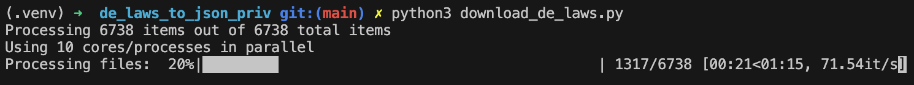
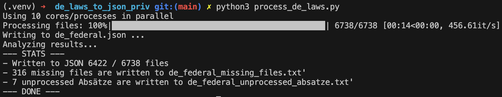

<div align="center">
  <h3 align="center">All German laws to JSON</h3>
</div>

## Overview
**de_laws_to_json** enables you to acquire all of Germany's federal laws in a structured JSON format. This can be useful for vector or document databases. It performs the following:
- Downloads all (>6000) federal laws from [gesetze-im-internet](https://www.gesetze-im-internet.de/) via their [XML index](https://www.gesetze-im-internet.de/gii-toc.xml).
- Transforms XML files to JSON, tokenizing text using tiktoken.
- Consolidates all laws into a single JSON file.

Shortened example output ([examples/BJNR001950896.json](examples/BJNR001950896.json?raw=true)):
```json
{
  "key": "BGB",
  "output": {
    "meta": {
      "source": "BJNR001950896.xml",
      "download_date": "2023-10-20",
      "title": "Bürgerliches Gesetzbuch",
      "last_changed": "1896-08-18",
      "alt_title": ""
    },
    "metadaten": {
      "jurabk": "BGB",
      "amtabk": "BGB",
      "ausfertigung-datum": "1896-08-18",
      "fundstelle": {},
      "langue": "Bürgerliches Gesetzbuch",
      "standangabe": []
    },
    "norms": [
      {
        "meta": {
          "norm_id": "§ 7",
          "title": "Wohnsitz; Begründung und Aufhebung"
        },
        "paragraphs": [
          {
            "meta": {
              "paragraph_id": "1",
              "token": 28
            },
            "content": "(1) Wer sich an einem Orte ständig niederlässt, begründet an diesem Ort seinen Wohnsitz."
          },
          {
            "meta": {
              "paragraph_id": "2",
              "token": 18
            },
            "content": "(2) Der Wohnsitz kann gleichzeitig an mehreren Orten bestehen."
          },
          {
            "meta": {
              "paragraph_id": "3",
              "token": 35
            },
            "content": "(3) Der Wohnsitz wird aufgehoben, wenn die Niederlassung mit dem Willen aufgehoben wird, sie aufzugeben."
          }
        ]
      },
    ]
  }
}
```


## Deployment
### Download Laws
See the instructions in [download_de_laws.py](download_de_laws.py)

```
This function downloads all (>6000) federal laws
from https://www.gesetze-im-internet.de/gii-toc.xml as
individual XML and copies them to ./de_federal_raw.

It does so using multiprocessing to speed up the process.
To use this in a Jupyter notebook you likely need to remove multiprocessing.

Prerequisites:
1) Create a virtual environment:
python3 -m venv ./.venv
source ./.venv/bin/activate

2) Install dependencies:
pip3 install tqdm requests

3) Run this script:
python3 download_de_laws.py
```



### Process laws
See the instructions in [download_de_laws.py](download_de_laws.py)

```
This function processes all XML laws in the folder ./de_federal_raw
and writes them to ./de_federal_json as individual JSON files.
Finally, it merges all JSON files to one ./de_federal.json file.
This script using multiprocessing using the available CPUs of your machine.

1) Create a virtual environment:
python3 -m venv ./.venv
source ./.venv/bin/activate

2) Install dependencies:
pip3 install bs4 lxml tiktoken tqdm

3) Run this script:
python3 process_de_laws.py
```



_Missing files can be caused by "empty" laws that just contain an image. Unprocessed Absätze can be caused by malformed XML files. To double-check, you can take a look at the debug txt files._

## Future Improvements
- Support for processing individual sentences ("Sätze") is not available; smallest unit is a paragraph ("Absatz").
